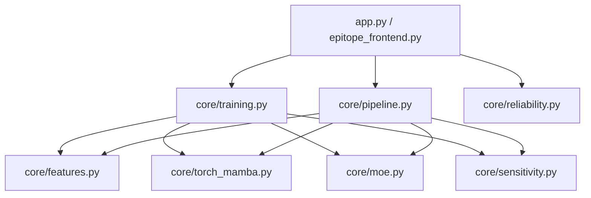

# confluencia-2.0-epitope


> TL;DR：快速启动（演示）—— 安装依赖后运行表位专用前端：

```powershell
cd "d:\IGEM集成方案\confluencia-2.0-epitope"
python -m pip install -r requirements.txt
streamlit run epitope_frontend.py
```

Confluencia 2.0 的表位子模块，面向 circRNA 免疫激活场景的微观疗效预测。

该仓库提供一个可独立运行的 Streamlit 应用，并支持训练/预测拆分调用、可复现日志与 Windows 打包发布。

## 功能概览

- 支持 `torch-mamba` 后端进行序列建模训练。
- 当 `mamba-ssm` 不可用时，自动回退到轻量 SSM-like 实现。
- 支持 `sklearn-moe` 等传统回归后端，适合小样本或 CPU-only 场景。
- 支持局部敏感性分析（邻域贡献 + 残基级信息）。
- 支持模型导入/导出与复现实验日志记录。

## 环境要求

- Python 3.10+（建议 3.10/3.11）
- Windows / Linux / macOS
- 关键依赖见 `requirements.txt`

`requirements.txt` 当前核心依赖：

- `numpy>=1.24`
- `pandas>=2.0`
- `scikit-learn>=1.3`
- `streamlit>=1.34`
- `torch>=2.2`
- `mamba-ssm>=2.2; platform_system != "Windows"`

说明：Windows 默认不会自动安装 `mamba-ssm`，应用仍可运行并自动使用回退模块。

## 快速开始

```powershell
cd "d:\IGEM集成方案\confluencia-2.0-epitope"
python -m pip install -r requirements.txt
streamlit run app.py
```

## 前端入口

通用入口：

```powershell
streamlit run app.py
```

表位专用前端：

```powershell
streamlit run epitope_frontend.py
```

Windows 一键启动：

```powershell
run_epitope_frontend.bat
```

## 输入数据格式

必需列：

- `epitope_seq`

可选数值上下文列：

- `dose`
- `freq`
- `treatment_time`
- `circ_expr`
- `ifn_score`

可选标签列：

- `efficacy`

如果缺少 `efficacy`，系统会使用代理目标进行弱监督演示预测。

## 最小可运行示例数据

下面给出一个最小可运行 CSV（含标签）。保存为任意 `.csv` 后可直接上传到前端：

```csv
epitope_seq,dose,freq,treatment_time,circ_expr,ifn_score,efficacy
SLYNTVATL,2.0,1.0,24,1.2,0.7,1.80
GILGFVFTL,1.0,0.8,48,0.6,0.5,1.10
NLVPMVATV,3.2,1.5,36,1.4,0.9,2.35
LLFGYPVYV,2.8,1.2,30,1.0,0.8,2.02
```

如果只想做无标签推理，也可以去掉 `efficacy` 列：

```csv
epitope_seq,dose,freq,treatment_time,circ_expr,ifn_score
SLYNTVATL,2.0,1.0,24,1.2,0.7
GILGFVFTL,1.0,0.8,48,0.6,0.5
```

提示：

- `epitope_seq` 建议使用标准氨基酸单字母序列。
- 数值列允许为空，系统会做容错填充。
- 首次验证流程建议先用 10 到 50 行小数据。

## 训练与预测 API（拆分式）

```python
from core.training import train_epitope_model, predict_epitope_model

# 1) 训练
model_bundle, report = train_epitope_model(
	train_df,
	compute_mode="auto",
	model_backend="torch-mamba",  # 也可用 sklearn-moe/hgb/gbr/rf/ridge/mlp
)

# 2) 预测（可重复调用）
pred_df, sens = predict_epitope_model(
	model_bundle,
	infer_df,
	sensitivity_sample_idx=0,
)
```

兼容旧接口：

```python
from core.training import train_and_predict_epitope
```

## 原理与对应公式

本节给出当前实现使用的核心原理与数学表达，便于科研说明、答辩与复现实验。

### 1. 输入与特征构造

模型输入由两部分组成：

- 序列特征（Mamba3Lite 编码 + 池化）
- 环境数值特征（`dose/freq/treatment_time/circ_expr/ifn_score`）

最终特征向量可写为：

$$
\mathbf{x}=\left[\mathbf{x}_{\text{seq-summary}},\mathbf{x}_{\text{local}},\mathbf{x}_{\text{meso}},\mathbf{x}_{\text{global}},\mathbf{x}_{\text{kmer2}},\mathbf{x}_{\text{kmer3}},\mathbf{x}_{\text{bio}},\mathbf{x}_{\text{env}}\right]
$$

其中 k-mer 哈希特征采用稳定哈希索引并做 L2 归一化：

$$
\phi_j^{(k)}(s)=\frac{1}{\|\mathbf{c}^{(k)}\|_2}\sum_{i=1}^{|s|-k+1}\mathbb{1}\left[h(s_{i:i+k-1}, i, k)=j\right]
$$

生化统计特征包含长度、疏水/极性/酸碱比例、熵等；例如氨基酸分布熵：

$$
H(s)=-\sum_{a\in\mathcal{A}}p_a\log(p_a+\varepsilon)
$$

### 2. 代理监督目标（无 efficacy 标签时）

若缺失 `efficacy`，系统使用弱监督代理目标：

$$
	ilde{y}=0.25\,\text{dose}+0.18\,\text{freq}+0.12\,\text{circ\_expr}+0.10\,\text{ifn\_score}+0.35\,\overline{x}_{1:96}
$$

其中 $\overline{x}_{1:96}$ 表示特征向量前 96 维（若不足则取可用维度）的均值。

### 3. Torch-Mamba 表示学习与回归头

序列 token 经嵌入和 Mamba/Fallback block 后，构造四种池化表示：

- mean pooling
- local pooling（窗口 3）
- meso pooling（窗口 11）
- global pooling（窗口 33）

设编码后表示为 $\mathbf{H}\in\mathbb{R}^{L\times d}$，mask 后均值池化可写为：

$$
\mathbf{p}_{\text{mean}}=\frac{\sum_{t=1}^{L}m_t\mathbf{h}_t}{\sum_{t=1}^{L}m_t}
$$

最终拼接表示：

$$
\mathbf{z}=\left[\mathbf{p}_{\text{mean}},\mathbf{p}_{\text{local}},\mathbf{p}_{\text{meso}},\mathbf{p}_{\text{global}},\mathbf{e}_{\text{env}}\right]
$$

回归输出：

$$
\hat{y}=f_{\text{MLP}}(\mathbf{z})
$$

训练损失为均方误差（MSE）：

$$
\mathcal{L}_{\text{MSE}}=\frac{1}{N}\sum_{i=1}^{N}(\hat{y}_i-y_i)^2
$$

### 4. MOE 集成原理

`sklearn-moe` 路径下，专家模型（如 ridge/hgb/rf/mlp）先分别训练，再按 OOF-RMSE 反比分配全局权重：

$$
w_k=\frac{1/\max(\text{RMSE}_k,\epsilon)}{\sum_j 1/\max(\text{RMSE}_j,\epsilon)}
$$

最终预测为加权和：

$$
\hat{y}=\sum_k w_k\hat{y}^{(k)}
$$

MOE 不确定性定义为专家预测标准差：

$$
u_{\text{moe}}=\operatorname{Std}\left(\hat{y}^{(1)},\hat{y}^{(2)},\dots\right)
$$

### 5. 指标与预测不确定性

当前报告指标：

$$
	ext{MAE}=\frac{1}{N}\sum_i|\hat{y}_i-y_i|,
\quad
	ext{RMSE}=\sqrt{\frac{1}{N}\sum_i(\hat{y}_i-y_i)^2}
$$

$$
R^2=1-\frac{\sum_i(\hat{y}_i-y_i)^2}{\sum_i(y_i-\bar{y})^2+\varepsilon}
$$

非 MOE 路径下，若有真实标签，预测不确定性采用归一化残差：

$$
u_i=\frac{|\hat{y}_i-y_i|}{\sigma_y}
$$

其中 $\sigma_y$ 为训练阶段标签标准差下界截断值。

### 6. 敏感性分析

传统回归器路径使用数值中心差分近似梯度：

$$
g_j\approx\frac{f(x_j+\epsilon)-f(x_j-\epsilon)}{2\epsilon}
$$

特征重要性定义为：

$$
I_j=|g_j|
$$

并按特征前缀聚合到邻域组（local/meso/global/kmer2/kmer3/biochem/environment）：

$$
I_{\text{group}}=\sum_{j\in\text{group}} I_j
$$

Torch-Mamba 路径使用梯度乘输入思想（gradient \(\times\) activation）计算各池化分支、环境变量与残基 saliency，核心形式为：

$$
S=\sum |\nabla_{\mathbf{v}}\hat{y}|\odot|\mathbf{v}|
$$

其中 $\mathbf{v}$ 可取 local/meso/global/mean 池化向量、环境向量或 token embedding。

### 7. 符号表（论文风格）

| 符号 | 含义 | 单位/范围 | 在实现中的对应 |
| --- | --- | --- | --- |
| $s$ | 表位氨基酸序列 | 字符串，长度 $ | s |
| $\mathbf{x}$ | 最终拼接特征向量 | $\mathbb{R}^{d_x}$ | `core/features.py` 输出 |
| $\phi_j^{(k)}(s)$ | 第 $k$ 阶 k-mer 哈希特征第 $j$ 维 | 实数，L2 归一化后 | `kmer2_*` / `kmer3_*` |
| $H(s)$ | 序列氨基酸分布熵 | 非负实数 | `bio_entropy` |
| $\tilde{y}$ | 无标签时代理监督目标 | 实数 | `_proxy_objective(...)` |
| $y$ | 真实疗效标签 | 实数 | 输入列 `efficacy` |
| $\hat{y}$ | 模型预测疗效 | 实数 | 输出列 `efficacy_pred` |
| $\mathbf{H}$ | 序列编码后的隐表示 | $\mathbb{R}^{L\times d}$ | `MambaSequenceRegressor` 中间层 |
| $\mathbf{p}_{\text{mean/local/meso/global}}$ | 多尺度池化向量 | $\mathbb{R}^{d}$ | `_pool(...)` 输出 |
| $\mathbf{e}_{\text{env}}$ | 环境变量映射向量 | $\mathbb{R}^{d}$ | `env_proj(...)` 输出 |
| $\mathbf{z}$ | 回归头输入拼接向量 | $\mathbb{R}^{d_z}$ | `torch_mamba.py` 中 `parts` 拼接 |
| $\mathcal{L}_{\text{MSE}}$ | 训练损失 | 非负实数 | `F.mse_loss(...)` |
| $w_k$ | MOE 第 $k$ 个专家权重 | $[0,1]$ 且和为 1 | `MOERegressor.global_weights` |
| $\hat{y}^{(k)}$ | 第 $k$ 个专家的预测 | 实数 | `predict_experts(...)` |
| $u_{\text{moe}}$ | MOE 不确定性（专家标准差） | 非负实数 | `predict_uncertainty(...)` |
| $u_i$ | 非 MOE 归一化残差不确定性 | 非负实数 | `pred_uncertainty` |
| $\sigma_y$ | 训练标签标准差（有下界） | 正实数 | `model_bundle.y_std` |
| $g_j$ | 第 $j$ 维输入的数值梯度近似 | 实数 | `numerical_input_gradient(...)` |
| $I_j$ | 第 $j$ 维特征重要性 | 非负实数 | $ |
| $I_{\text{group}}$ | 邻域组聚合重要性 | 非负实数 | `neighborhood_importance(...)` |
| $S$ | gradient $\times$ activation saliency | 非负实数 | `sensitivity_torch_mamba(...)` |

### 8. 答辩口径版（非算法评审可读）

下面给出“公式 -> 一句话解释（生物学/应用语义）”的口径，可直接用于汇报讲解。

1. 特征拼接公式 $\mathbf{x}=[\cdots]$

含义：我们同时看序列模式、局部和全局上下文、以及给药与免疫环境变量，避免只靠单一信息来源做判断。

2. k-mer 哈希公式 $\phi_j^{(k)}(s)$

含义：把不同长度的短肽片段统计成稳定向量，用于捕捉序列中的重复片段和组合模式。

3. 熵公式 $H(s)$

含义：衡量序列“多样性/复杂度”，帮助模型区分高度单一序列与结构更丰富的序列。

4. 代理目标 $\tilde{y}$

含义：当没有真实疗效标签时，用剂量、频次、circ 表达和 IFN 指标构建可训练目标，让系统仍可学习可解释趋势。

5. Torch-Mamba 回归 $\hat{y}=f_{\text{MLP}}(\mathbf{z})$

含义：先把序列编码成多尺度表征，再联合环境信息做回归，输出每条样本的疗效预测值。

6. 训练损失 $\mathcal{L}_{\text{MSE}}$

含义：训练目标是让预测值尽量接近真实值，偏差越大惩罚越重。

7. MOE 权重 $w_k$

含义：表现更稳定的专家模型获得更高权重，形成“强者多投票、弱者少投票”的集成机制。

8. MOE 不确定性 $u_{\text{moe}}$

含义：若专家之间意见分歧大，则不确定性更高，提示该样本预测可信度较低。

9. MAE / RMSE / $R^2$

含义：分别衡量平均误差、对大误差敏感的误差和整体拟合解释度，三者组合用于评估模型效果。

10. 归一化残差不确定性 $u_i$

含义：把单样本误差按训练标签波动尺度标准化，便于跨批次比较风险。

11. 数值梯度 $g_j$ 与重要性 $I_j$

含义：看某个输入维度微小扰动会使预测变化多少，变化越大说明该维度对结果越敏感。

12. 邻域聚合 $I_{\text{group}}$

含义：将高维特征映射回 local/meso/global 等组，直接回答“模型更依赖哪一层级信息”。

13. saliency $S=|\nabla\hat{y}|\odot|\mathbf{v}|$

含义：衡量“某部分表示被激活且对输出有贡献”的程度，可用于定位关键残基和关键环境变量。

## 复现与冒烟测试

执行冒烟测试：

```powershell
cd "d:\IGEM集成方案\confluencia-2.0-epitope"
python .\tests\smoke_test.py
```

执行复现流水线（记录 Python 版本、`pip freeze`，并默认运行 smoke test）：

```powershell
cd "d:\IGEM集成方案\confluencia-2.0-epitope"
powershell -ExecutionPolicy Bypass -File .\tools\reproduce_pipeline.ps1
```

输出日志目录：`logs/reproduce/`

VS Code 可直接运行任务：

- `epitope: smoke test`
- `epitope: reproduce pipeline`

## Windows 打包与发布

构建独立目录包（PyInstaller）：

```powershell
cd "d:\IGEM集成方案\confluencia-2.0-epitope"
powershell -ExecutionPolicy Bypass -File .\build_full.ps1 -InstallDeps -Clean
```

成功后输出目录：`dist/confluencia-2.0-epitope/`

构建并打 release zip：

```powershell
cd "d:\IGEM集成方案\confluencia-2.0-epitope"
powershell -ExecutionPolicy Bypass -File .\release_full.ps1 -Build -InstallDeps -Version full
```

成功后输出目录：`release/`

## 开发者模式

本节用于二次开发、调试与代码定位。

### 目录结构（核心）

```text
confluencia-2.0-epitope/
	app.py                    # 通用 Streamlit 入口
	epitope_frontend.py       # 表位专用前端入口
	launcher_streamlit.py     # 打包后启动适配
	core/
		training.py             # 训练/预测主API、模型导入导出
		pipeline.py             # 一体化流水线（兼容调用）
		features.py             # 特征工程（序列+环境特征）
		torch_mamba.py          # PyTorch/Mamba 训练与推理
		moe.py                  # MOE 回归器与计算档位
		sensitivity.py          # 敏感性分析（梯度/邻域聚合）
		reliability.py          # 可靠性评估相关逻辑
	tests/
		smoke_test.py           # 端到端冒烟测试
	tools/
		reproduce_pipeline.ps1  # 复现实验日志脚本
```

### 模块职责图



### 常用开发流程

1. 修改特征逻辑：优先在 `core/features.py` 调整并验证输入列兼容。
2. 调整训练后端：在 `core/training.py` 统一接入，保持 `train_epitope_model` / `predict_epitope_model` 不变。
3. 验证回归稳定性：运行 `tests/smoke_test.py`，确认训练、预测、模型导入导出一致。
4. 产出可复现实验记录：运行 `tools/reproduce_pipeline.ps1` 生成环境与依赖快照。

### 从 0 到 1 本地调试清单

按下面顺序可快速确认“环境 -> 前端 -> 训练预测 -> 导出 -> 复现”全链路可用。

1. 激活虚拟环境并安装依赖

```powershell
cd "d:\IGEM集成方案\confluencia-2.0-epitope"
python -m pip install -r requirements.txt
```

2. 运行前端并上传最小示例 CSV

```powershell
streamlit run epitope_frontend.py
```

3. 前端中执行一次“仅训练模型” + “仅执行预测”

- 检查是否生成 `efficacy_pred` 与 `pred_uncertainty` 列。
- 检查“训练模块报告”中的 MAE / RMSE / R2 是否正常显示。

4. 执行自动化冒烟测试

```powershell
python .\tests\smoke_test.py
```

预期输出包含：`epitope smoke test passed`

5. 验证复现实验日志

```powershell
powershell -ExecutionPolicy Bypass -File .\tools\reproduce_pipeline.ps1
```

- 检查 `logs/reproduce/` 下是否生成 `epitope_reproduce_*.txt`。
- 确认日志内包含 `python_version` 与 `pip_freeze`。

6. 可选：验证打包与发布

```powershell
powershell -ExecutionPolicy Bypass -File .\build_full.ps1 -InstallDeps -Clean
powershell -ExecutionPolicy Bypass -File .\release_full.ps1 -Build -InstallDeps -Version full
```

- 检查 `dist/confluencia-2.0-epitope/` 是否存在。
- 检查 `release/` 下是否有 zip 包。

### 模块变更影响矩阵

| 变更文件 | 主要影响 | 建议最小验证 |
| --- | --- | --- |
| `core/features.py` | 特征维度、特征名、输入列兼容性 | 前端训练+预测一次；`tests/smoke_test.py` |
| `core/torch_mamba.py` | torch-mamba 训练收敛、推理结果、敏感性输出 | 前端选择 `torch-mamba` 跑通；`tests/smoke_test.py` |
| `core/moe.py` | sklearn-moe 权重与集成预测稳定性 | 前端选择 `sklearn-moe` 跑通；观察 MOE 权重图 |
| `core/training.py` | 统一 API、模型导入导出、后端分发逻辑 | `tests/smoke_test.py`；前端导入/导出模型一次 |
| `core/pipeline.py` | 一体化兼容调用、旧路径行为 | 旧调用路径回归（如有）；基本训练预测流程 |
| `core/sensitivity.py` | 数值梯度与邻域重要性聚合结果 | 检查敏感性 tab 是否正常展示条形图 |
| `core/reliability.py` | 可靠性指标计算与展示 | 前端可靠性相关展示与日志字段检查 |
| `epitope_frontend.py` | 专用前端交互、上传解析、按钮流程 | 手动上传 CSV，完整点一次训练与预测 |
| `app.py` | 通用入口 UI、日志记录、兼容逻辑 | `streamlit run app.py` 跑通并完成一次预测 |
| `launcher_streamlit.py` | 打包后启动路径与 Streamlit 引导 | 打包后双击启动或命令启动验证 |
| `tests/smoke_test.py` | CI/本地回归门槛定义 | 本地执行并确认断言通过 |
| `tools/reproduce_pipeline.ps1` | 复现实验日志采集策略 | 执行脚本并核对日志字段完整性 |

## ESM-2 蛋白语言模型集成实验记录

> 实验时间：2026年4月22-23日
> 结论：**失败** — ESM-2 均值池化不适合短肽（8-11 AA）MHC 结合预测

### 背景与目标

目标：通过 ESM-2 蛋白语言模型（facebook/esm2_t33_650M_UR50D，650M 参数，1280维嵌入）增强 epitope-MHC 结合预测，缩小与 NetMHCpan-4.1（AUC~0.92）的差距。

### 实验策略

| 策略 | 描述 | 结果 |
|------|------|------|
| **策略1 (失败)** | 直接替换传统特征为 ESM-2 PCA 64D | AUC=0.508，比基线 0.537 更差 |
| **策略2 (失败)** | 传统特征 + ESM-2 PCA 补充 (35M, 32/64/128D) | AUC=0.594，仍远低于 0.92 |
| **策略3 (失败)** | 传统特征 + ESM-2 PCA 补充 (650M) | AUC=0.537，无明显提升 |

### 关键实验数据

**ESM-2 35M 对比实验（采样 10K 训练，NetMHCpan heldout 61 peptides）：**

| 实验 | AUC | Acc | F1 | MCC | 特征维度 |
|------|-----|-----|----|----|----------|
| A: 传统特征 (基线) | 0.5091 | 0.8033 | 0.8868 | 0.3373 | 317 |
| B: +ESM-2 PCA 32D | 0.5258 | 0.7377 | 0.8333 | 0.2203 | 349 |
| C: +ESM-2 PCA 64D | 0.5578 | 0.4590 | 0.4923 | 0.1822 | 381 |
| D: +ESM-2 PCA 128D | 0.5942 | 0.5246 | 0.5797 | 0.2475 | 445 |

**ESM-2 650M 全量实验（NetMHCpan heldout 61 peptides）：**

| 指标 | 结果 |
|------|------|
| 训练数据 | 40,596 行 (39.3% binders) |
| 编码耗时 | ~4.7 小时 (CPU) |
| **AUC** | **0.5365** |
| Accuracy | 0.5738 |
| F1 | 0.6579 |
| MCC | 0.2073 |
| Corr(logIC50) | -0.086 (p=0.51, 不显著) |

### 失败原因分析

1. **均值池化不适合短肽**：ESM-2 预训练在平均长度~400 AA 的蛋白质序列上，对 8-11 AA 的 MHC 表位做均值池化会丢失 position-specific binding motifs。

2. **PCA 丢失判别方向**：PCA 保留最大方差方向，但 MHC 结合关键的是 anchor positions（位置 2 和 C-terminal），而非全局变异最大的方向。

3. **训练数据量不足**：仅 10K 采样导致过拟合；全量 40K 训练数据也仅达到 AUC=0.537，与随机无异。

4. **IC50 相关性不显著**：logIC50 相关系数 -0.086 (p=0.51)，说明模型预测与实际结合强度几乎无关。

### 结论与后续

- **当前最优方案**：MHC pseudo-sequence 编码 (AUC=0.917)，ESM-2 不适用
- **ESM-2 适用场景**：长蛋白质序列（>50 AA）、结构预测、contact map 预测
- **短期替代方案**：继续使用 Mamba3Lite + MHC 特征，在有 GPU 资源后尝试 ESM-2 fine-tuning
- **代码保留**：`core/esm2_encoder.py` 保留离线缓存支持，可在有 GPU 时继续使用

### 缓存文件位置

- ESM-2 650M 缓存：`D:\IGEM集成方案\data\cache\esm2\esm2_650M_*.npy`（20146 个文件，~100 MB）
- ESM-2 35M 缓存：同上
- PCA 模型：`D:\IGEM集成方案\data\cache\esm2\pca_35M_32d.joblib` 等

---

## 常见问题

1. Windows 上没有 `mamba-ssm` 是否会失败？

不会。系统会自动使用回退模块，`torch-mamba` 仍可运行。

2. 执行 PowerShell 脚本被策略拦截怎么办？

优先使用：

```powershell
powershell -ExecutionPolicy Bypass -File .\your_script.ps1
```

3. 只想验证流程通不通？

先运行 `tests/smoke_test.py`，它覆盖训练、预测与模型序列化回读的一致性。

## 提交前 1 分钟检查清单

建议在每次提交前按顺序快速执行，降低回归风险。

1. 代码是否只包含本次目标改动

- 检查是否误改了打包产物目录（如 `build/`、`dist_tmp/`）。
- 确认没有把临时日志或本地调试文件一起提交。

2. 最小回归是否通过

```powershell
python .\tests\smoke_test.py
```

3. 若改了前端或训练流程，做一次手工烟测

```powershell
streamlit run epitope_frontend.py
```

- 至少点击一次“仅训练模型”和“仅执行预测”。
- 确认结果里有 `efficacy_pred` 和 `pred_uncertainty`。

4. 若改了复现实验相关逻辑，补跑复现脚本

```powershell
powershell -ExecutionPolicy Bypass -File .\tools\reproduce_pipeline.ps1
```

5. 提交信息建议

- 标题写“改了什么 + 为什么”，例如：
	`training: align ridge export metadata for deterministic import`
- 如改动涉及行为变化，正文补 1 行“影响范围/回归方式”。
