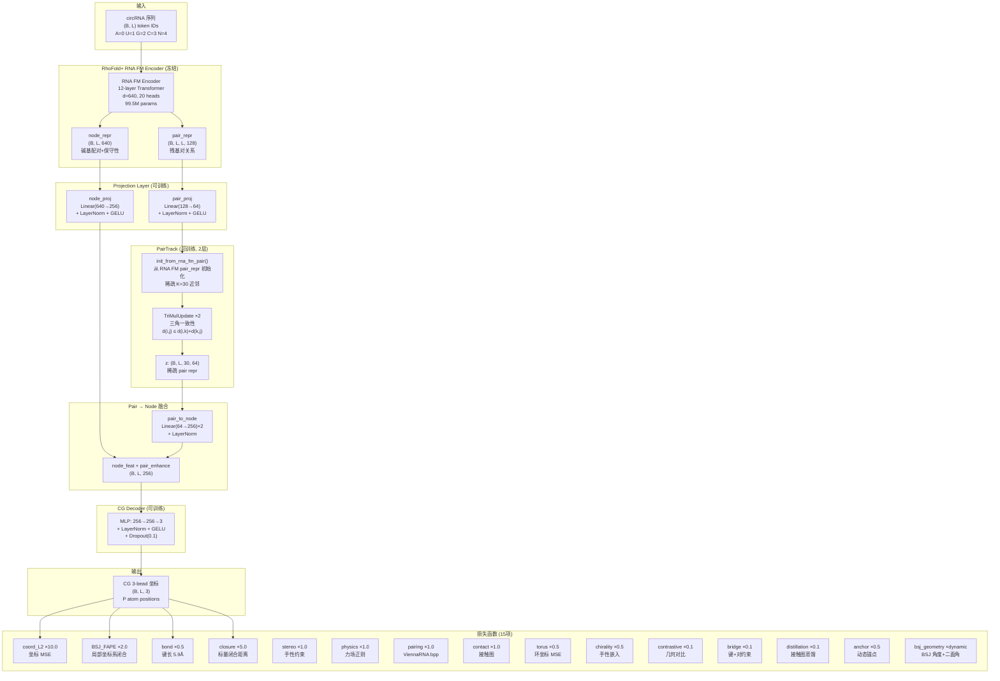
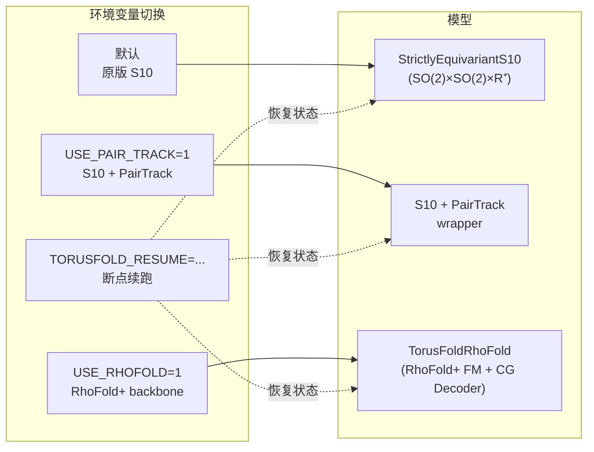
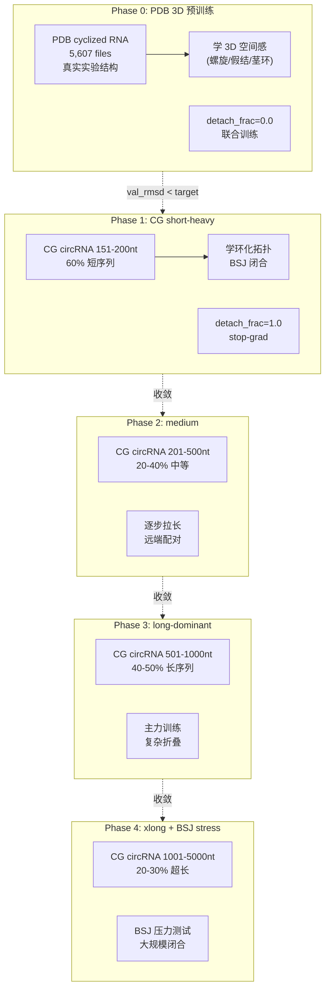
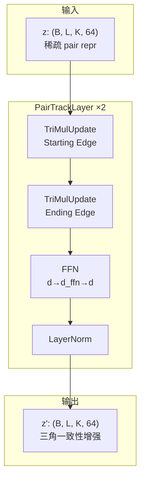
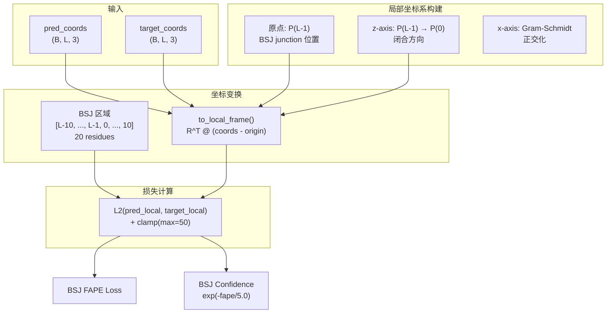

# TorusFold + RhoFold+ 完整架构图

## 1. 整体数据流



## 2. 三种训练模式切换



## 3. 训练课程 (5-Phase Curriculum)



## 4. PairTrack 内部结构



## 5. BSJ FAPE 损失



## 6. 关键参数一览

| 组件 | 参数量 | 状态 | 说明 |
|------|--------|------|------|
| RNA FM Encoder | 99,521,546 | 冻结 9/12 层 | 碱基配对+保守性 |
| PairTrack | 132,864 | 可训练 | 三角一致性×2层 |
| CG Decoder | 67,075 | 可训练 | MLP 256→256→3 |
| Projections | ~200,000 | 可训练 | 640→256, 128→64 |
| PairToNode | ~130,000 | 可训练 | 64→256→256 |
| **总计** | **99,994,253** | **25.5% 可训练** | |

## 7. 训练数据

| 数据集 | 数量 | 大小 | 来源 |
|--------|------|------|------|
| 主训练 | 82,106 | 523MB | circrna_3d_all_consolidated.npz |
| Pair probs | — | 20.3GB | ViennaRNA bpp |
| PDB cyclized | 5,607 | — | Phase 0 预训练 |

### 长度分布
```
151-200nt:    6,962  (8.5%)   ← Phase 1
201-500nt:   38,104  (46.4%)  ← Phase 2
501-1000nt:  32,291  (39.3%)  ← Phase 3
1001-5000nt:  4,749  (5.8%)   ← Phase 4
```

## 8. 文件索引

| 文件 | 行数 | 功能 |
|------|------|------|
| `rhofold_backbone.py` | ~200 | RhoFold+ RNA FM 集成 |
| `pair_track.py` | ~350 | 稀疏三角一致性 |
| `cg_decoder.py` | ~100 | P atom → 3-bead |
| `bsj_fape.py` | ~250 | 局部坐标系损失 |
| `torusfold_rhofold.py` | ~250 | 完整模型组装 |
| `train_s10_curriculum.py` | ~1300 | 主训练脚本 (15 loss, 5 phase) |
| `train_rhofold_cg.py` | ~300 | 独立训练 (简化版) |
| `test_2oiu_rhofold.py` | ~150 | 2OIU 验证 |

## 9. 使用方式

```bash
# 原版 S10
python train_s10_curriculum.py --labels ./data/circrna_3d_all_consolidated --device cuda

# S10 + PairTrack
USE_PAIR_TRACK=1 python train_s10_curriculum.py --labels ./data/circrna_3d_all_consolidated --device cuda

# RhoFold+ backbone
USE_RHOFOLD=1 python train_s10_curriculum.py --labels ./data/circrna_3d_all_consolidated --device cuda

# 断点续跑
TORUSFOLD_RESUME=models/s10_curriculum/phase0_end_full.pt \
  python train_s10_curriculum.py --labels ./data/circrna_3d_all_consolidated --device cuda
```
