# Confluencia 3.0 统一架构图

```mermaid
%%{init: {'theme': 'base', 'themeVariables': { 'primaryColor': '#1a1b26', 'primaryTextColor': '#c0caf5', 'primaryBorderColor': '#7aa2f7', 'lineColor': '#565f89', 'secondaryColor': '#24283b', 'tertiaryColor': '#414d68'}}}%%

flowchart TB
    subgraph ROOT["🎯 CONFLUENCIA 3.0 统一计算平台"]
        direction TB

        subgraph ENTRY["📤 入口层"]
            CLI["CLI<br/>main.py"]
            STUDIO["🧬 Confluencia Studio<br/>Home.py"]
            APP["📊 Frontend App<br/>app.py"]
        end

        subgraph ORCHESTRA["🎛️ 编排层 (core/)"]
            AGENT["TNBCSimulacrum<br/>agent.py"]
            BUS["EventBus<br/>event_bus.py"]
            EVENTS["40+ 事件类型<br/>events.py"]
            SCHEMA["StateSchema<br/>state_schema.py<br/>(170+ 状态键)"]
            CONFIG["Confluencia3Config<br/>config.py"]
            BACKEND["Backend架构<br/>backend_architecture.py"]
        end

        subgraph MANAGERS["🔧 子系统管理器"]
            TMGR["TumorManager"]
            MMGR["TMEManager"]
            RXMGR["TreatmentManager"]
            BIOMGR["BiomarkerManager"]
            CLIMGR["ClinicalManager"]
            CRNAMGR["CircRNAManager ★"]
        end

        subgraph TUMOR["🧬 肿瘤子系统 (tumor/)"]
            GROW["GrowthEngine<br/>growth_engine.py<br/>Logistic/Gompertz"]
            HET["Heterogeneity<br/>heterogeneity.py<br/>亚克隆演化"]
            CSC["CSC Pool<br/>cancer_stem_cell.py"]
            ANGIO["Angiogenesis<br/>angiogenesis.py<br/>VEGF/MVD"]
            METS["Metastasis<br/>metastasis.py<br/>EMT/MET"]
        end

        subgraph TME["🏥 肿瘤微环境 (tme/)"]
            IMM["ImmuneDynamics<br/>immune_dynamics.py<br/>CD8/CD4/NK/Treg"]
            EVS["ImmuneEvasion<br/>immune_evasion.py<br/>PD-L1/MHC-I"]
            IED["Immunoediting<br/>immunoediting.py<br/>三阶段转换"]
            CAF["Fibroblast<br/>fibroblast.py<br/>CAF/ECM"]
        end

        subgraph RX["💊 治疗子系统 (treatment/)"]
            CHEMO["Chemotherapy<br/>chemotherapy.py"]
            IMMUNO["Immunotherapy<br/>immunotherapy.py"]
            TARGET["Targeted<br/>targeted.py"]
            RAD["Radiotherapy<br/>radiotherapy.py"]
            CIRCRX["CircRNATherapy<br/>circrna_therapy.py"]
            DRUGREG["DrugRegistry<br/>drug_pipeline/"]
        end

        subgraph CIRCRNA["🔬 circRNA子系统 ★ (circrna/)"]
            direction TB
            IMMSENSE["ImmuneSensing<br/>immune_sensing.py<br/>RIG-I/TLR/PKR"]
            STRUCT["StructurePredict<br/>structure_prediction.py<br/>ViennaRNA"]
            TFSCORE["TorusFoldScorer<br/>torusfold_scorer.py"]
            EVOLV["CircRNAEvolution<br/>cirrna_evolution.py"]
            BSJ["BSJ Features<br/>bsj_features.py"]

            subgraph TORUS["🧠 TorusFold DL (torusfold/)"]
                TFMAIN["TorusFold<br/>torusfold.py"]
                DIFF["Diffusion<br/>diffusion_structure.py"]
                EQUI["Equivariant<br/>equivariant_backbone.py"]
                PHYS["PhysicsHead<br/>physics_structure_head.py"]
                CONST["ConstraintSolver<br/>constraint_solver.py"]
                OPENMM["PhysicsBridge<br/>physics_bridge.py<br/>OpenMM"]
            end
        end

        subgraph PKPD["📈 PK/PD模块 (pk/)"]
            RNACTM["RNACTM<br/>rnactm.py<br/>circRNA PK模拟"]
            LEGACY["LegacyCTM<br/>legacy_ctm.py"]
        end

        subgraph ENCODER["🔤 编码器 (encoder/)"]
            ENCMODEL["RNATransformer<br/>model.py"]
            ENCTOK["RNATokenizer<br/>tokenizer.py"]
            ENCTRAIN["Train<br/>train.py"]
        end

        subgraph EVOLUTION["🧬 进化模块 (evolution/)"]
            CIRCEVOL["CircRNA Evolution<br/>cirrna_evolution.py"]
            MOLEVOL["Molecule Evolution<br/>molecule_evolution.py"]
            PARETO["ParetoFront<br/>pareto.py"]
        end

        subgraph BIOCLIN["📊 生物标志物与临床"]
            TRACK["BiomarkerTracker<br/>tracker.py"]
            SUBT["SubtypeClassifier<br/>subtype_classifier.py"]
            RESDET["ResistanceDetector<br/>resistance_detector.py"]
            RECIST["RECISTTracker<br/>recist.py"]
            SURV["SurvivalModel<br/>survival.py"]
            TOX["ToxicityGrader<br/>toxicity.py"]
        end

        subgraph EXPERIMENTS["🧪 实验模板 (experiments/)"]
            EXP1["experiment_akt_pi3k.py"]
            EXP2["experiment_ar_lar.py"]
            EXP3["experiment_chemo_response.py"]
            EXP4["experiment_circrna_therapy.py"]
            EXP5["experiment_combination_*.py"]
            EXP6["experiment_parp_brca.py"]
            EXP7["experiment_subtype_comparison.py"]
            EXPN["... 14个实验模板"]
        end

        subgraph PAGES["📄 Studio Pages"]
            P1["1_CircRNA_Analysis.py"]
            P2["2_Drug_Prediction.py"]
            P3["3_Epitope_Screening.py"]
            P4["4_TNBC_Simulator.py"]
            P5["5_Report_Export.py"]
            P6["6_Joint_Analysis.py"]
        end

        subgraph EXTERNAL["🌐 外部集成"]
            VIENNA["ViennaRNA<br/>(结构预测)"]
            ESM["ESM-2<br/>(蛋白语言模型)"]
            NETMHC["NetMHCpan<br/>(MHC结合)"]
            OPENMMEXT["OpenMM<br/>(MD模拟)"]
        end
    end

    %% 入口连接
    CLI --> AGENT
    STUDIO --> AGENT
    STUDIO --> PAGES
    APP --> AGENT

    %% 编排层内部连接
    AGENT <--> BUS
    AGENT --> SCHEMA
    AGENT --> CONFIG
    AGENT --> BACKEND
    BUS --> EVENTS

    %% 管理器连接
    AGENT --> TMGR
    AGENT --> MMGR
    AGENT --> RXMGR
    AGENT --> BIOMGR
    AGENT --> CLIMGR
    AGENT --> CRNAMGR

    %% 肿瘤连接
    TMGR --> GROW
    TMGR --> HET
    TMGR --> CSC
    TMGR --> ANGIO
    TMGR --> METS

    %% TME连接
    MMGR --> IMM
    MMGR --> EVS
    MMGR --> IED
    MMGR --> CAF

    %% 治疗连接
    RXMGR --> CHEMO
    RXMGR --> IMMUNO
    RXMGR --> TARGET
    RXMGR --> RAD
    RXMGR --> CIRCRX
    RXMGR --> DRUGREG

    %% circRNA连接
    CRNAMGR --> IMMSENSE
    CRNAMGR --> STRUCT
    CRNAMGR --> TFSCORE
    CRNAMGR --> EVOLV
    CRNAMGR --> BSJ
    CRNAMGR --> RNACTM

    TFSCORE --> TORUS
    TORUS --> TFMAIN
    TORUS --> DIFF
    TORUS --> EQUI
    TORUS --> PHYS
    TORUS --> CONST
    TORUS --> OPENMM

    %% 进化连接
    CRNAMGR --> EVOLUTION
    EVOLUTION --> CIRCEVOL
    EVOLUTION --> MOLEVOL
    EVOLUTION --> PARETO

    %% 生物标志物临床
    BIOMGR --> TRACK
    BIOMGR --> SUBT
    BIOMGR --> RESDET
    CLIMGR --> RECIST
    CLIMGR --> SURV
    CLIMGR --> TOX

    %% 编码器
    CIRCRNA --> ENCODER
    ENCODER --> ENCMODEL
    ENCODER --> ENCTOK
    ENCODER --> ENCTRAIN

    %% 外部集成
    BACKEND --> VIENNA
    BACKEND --> ESM
    BACKEND --> NETMHC
    PHYS --> OPENMMEXT

    %% 实验模板
    AGENT --> EXPERIMENTS

    %% 样式
    classDef core fill:#7aa2f7,stroke:#1a1b26,color:#1a1b26
    classDef tumor fill:#f7768e,stroke:#1a1b26,color:#1a1b26
    classDef tme fill:#9ece6a,stroke:#1a1b26,color:#1a1b26
    classDef rx fill:#bb9af7,stroke:#1a1b26,color:#1a1b26
    classDef circrna fill:#e0af68,stroke:#1a1b26,color:#1a1b26
    classDef torus fill:#ff9e64,stroke:#1a1b26,color:#1a1b26
    classDef clinic fill:#73daca,stroke:#1a1b26,color:#1a1b26
    classDef entry fill:#24283b,stroke:#7aa2f7,color:#c0caf5

    class AGENT,BUS,SCHEMA,CONFIG,BACKEND core
    class GROW,HET,CSC,ANGIO,METS tumor
    class IMM,EVS,IED,CAF tme
    class CHEMO,IMMUNO,TARGET,RAD,CIRCRX,DRUGREG rx
    class IMMSENSE,STRUCT,TFSCORE,EVOLV,BSJ,CRNAMGR circrna
    class TFMAIN,DIFF,EQUI,PHYS,CONST,OPENMM torus
    class TRACK,SUBT,RESDET,RECIST,SURV,TOX clinic
    class CLI,STUDIO,APP,PAGES entry
```

---

## 模块说明

### 🎯 平台概述
Confluencia 3.0 是一个统一的 circRNA 药物发现平台，整合了：
- TNBC 数字孪生仿真
- circRNA 免疫原性分析
- TorusFold 深度学习结构预测
- 实验设计与分析

### 📤 入口层
| 入口 | 文件 | 用途 |
|-----|------|------|
| CLI | `main.py` | 命令行接口 |
| Studio | `Home.py` | 无代码Web界面 |
| App | `app.py` | Streamlit多标签页应用 |

### 🎛️ 编排层
核心组件协同工作：
- **TNBCSimulacrum**: 主编排器，协调所有子系统
- **EventBus**: pub/sub事件总线，模块解耦
- **StateSchema**: 170+状态键定义
- **Backend架构**: 可插拔后端 (heuristic/vienna/esm2)

### 🔧 子系统管理器
6个Manager统一调度：
1. **TumorManager** → 肿瘤生物学
2. **TMEManager** → 肿瘤微环境
3. **TreatmentManager** → 治疗效应
4. **BiomarkerManager** → 生物标志物
5. **ClinicalManager** → 临床评估
6. **CircRNAManager** ★ → circRNA分析核心

### 🔬 circRNA子系统 (核心)
四大支柱：
1. **RNACTM** → PK/PD模拟
2. **ViennaRNA** → 二级结构预测
3. **TorusFold** → 深度学习结构预测
4. **Simulacrum** → TNBC响应耦合

### 🧠 TorusFold DL
5种结构预测模式：
- `heuristic` → Backend降级
- `simple` → MDS快速推断
- `diffusion` → AF3风格扩散
- `physics_b` → 几何约束求解
- `physics_ba` → 几何+OpenMM精修

---

**版本**: 3.0.0 | **日期**: 2026-06-17 | **作者**: 颜子壹
